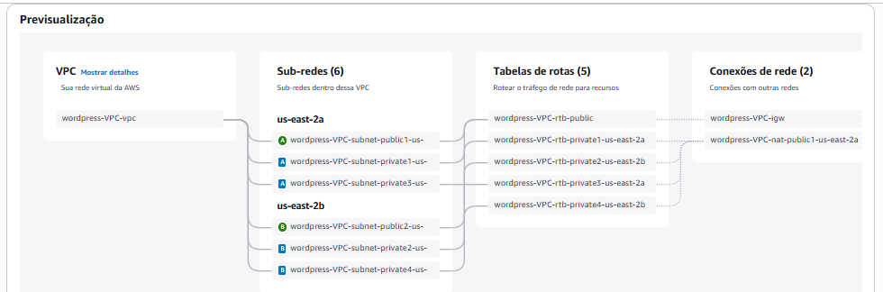
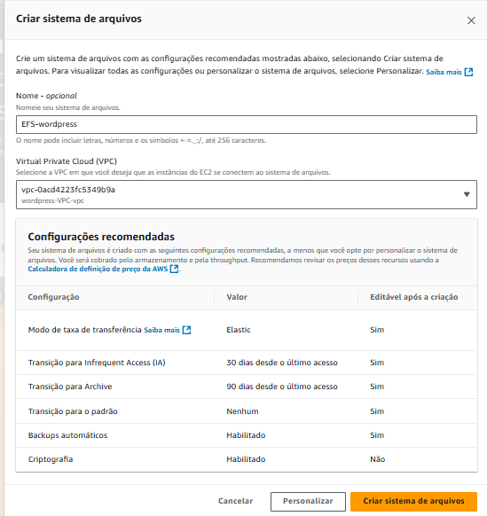
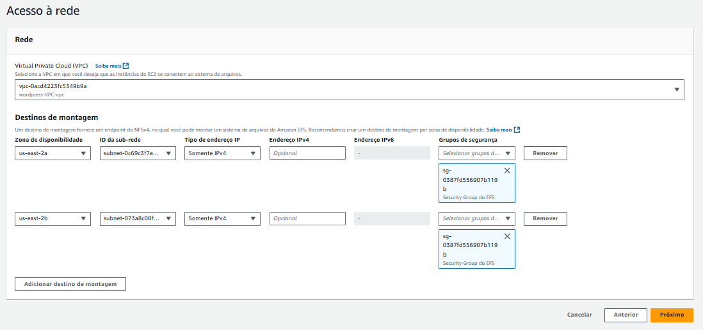
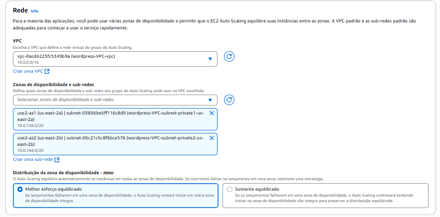
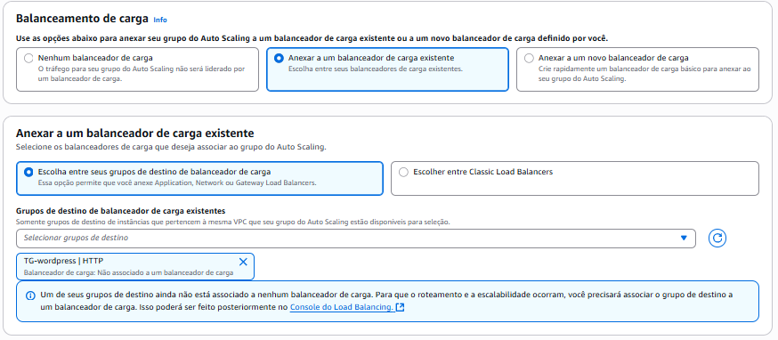
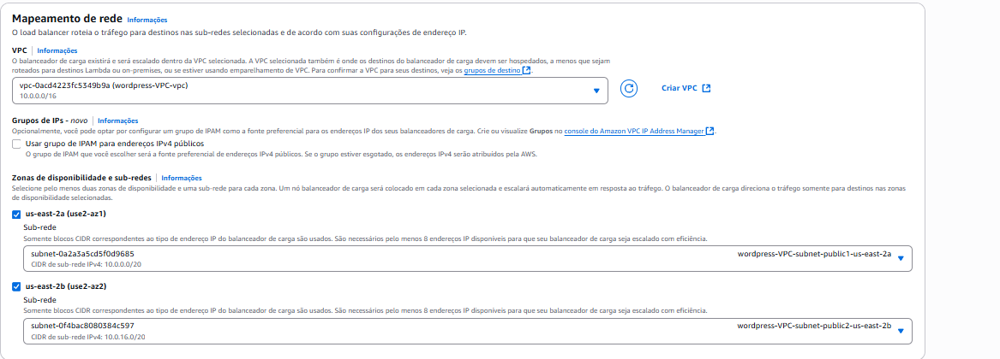

# Projeto WordPress de Alta Disponibilidade na AWS

Guia de implementação de uma arquitetura escalável e de alta disponibilidade para WordPress na nuvem da AWS.

## Objetivo do Projeto

O objetivo deste projeto é implantar uma infraestrutura para o WordPress na AWS que seja robusta, escalável e tolerante a falhas, simulando um ambiente de produção. A arquitetura utiliza serviços gerenciados da AWS para garantir a segurança, o desempenho e a alta disponibilidade da aplicação.

## Ferramentas e Tecnologias Utilizadas

* **AWS VPC (Virtual Private Cloud):** Para criação da rede privada e isolada na nuvem.
* **Amazon EC2 (Elastic Compute Cloud):** Como servidores virtuais para hospedar a aplicação WordPress.
* **Amazon RDS (Relational Database Service):** Para o banco de dados relacional gerenciado (MySQL).
* **Amazon EFS (Elastic File System):** Como sistema de arquivos compartilhado para os dados do WordPress.
* **Application Load Balancer (ALB):** Para distribuir o tráfego de entrada entre as instâncias.
* **Auto Scaling Group (ASG):** Para garantir a escalabilidade e a recuperação automática das instâncias.
* **AWS IAM (Identity and Access Management):** Para o gerenciamento seguro de acessos e permissões.

## Guia de Implementação

As etapas a seguir detalham o processo de construção da arquitetura.

### Etapa 1: Criação da Rede (VPC)

A base da infraestrutura é uma Virtual Private Cloud (VPC) para isolar os recursos da nuvem.

* **Estrutura:** A VPC será configurada em duas Zonas de Disponibilidade para alta disponibilidade. A estrutura de rede inclui 2 sub-redes públicas (para recursos com acesso externo, como o Load Balancer) e 4 sub-redes privadas (para recursos protegidos, como as instâncias EC2 e o banco de dados RDS).
* **Conectividade:** Um Internet Gateway será anexado à VPC para permitir a comunicação com a internet. NAT Gateways serão posicionados nas sub-redes públicas para permitir que os recursos nas sub-redes privadas iniciem conexões de saída (ex: para atualizações de software).
* **Detalhes Técnicos da VPC:**
    * **Bloco CIDR:** `10.0.0.0/16`
    * **Nomes de host DNS:** Ativado
    * **Resolução de DNS:** Ativado

  
   Diagrama da estrutura da VPC e seus componentes.

### Etapa 2: Configuração dos Grupos de Segurança

Grupos de Segurança (Security Groups) atuam como um firewall no nível da instância para controlar o tráfego de entrada e saída.

A seguir, as regras para cada componente:

#### Para as Instâncias EC2
* **Regras de Entrada:**
    | Tipo | Origem | Descrição |
    | :--- | :--- | :--- |
    | HTTP | Security Group do ALB | Permite receber tráfego web apenas do Application Load Balancer. |
* **Regras de Saída:**
    | Tipo | Destino | Descrição |
    | :--- | :--- | :--- |
    | MySQL/Aurora | Security Group do RDS | Permite a comunicação com o banco de dados. |
    | NFS | Security Group do EFS | Permite a comunicação com o sistema de arquivos EFS. |
    | HTTP/S | 0.0.0.0/0 | Permite acesso à internet para atualizações. |

#### Para o Banco de Dados RDS
* **Regras de Entrada:**
    | Tipo | Origem | Descrição |
    | :--- | :--- | :--- |
    | MySQL/Aurora | Security Group da EC2 | Permite acesso apenas das instâncias EC2 da aplicação. |
* **Regras de Saída:**
    | Tipo | Destino | Descrição |
    | :--- | :--- | :--- |
    | Todo o tráfego | 0.0.0.0/0 | Regra padrão de saída. |

#### Para o Sistema de Arquivos EFS
* **Regras de Entrada:**
    | Tipo | Origem | Descrição |
    | :--- | :--- | :--- |
    | NFS | Security Group da EC2 | Permite que as instâncias EC2 montem o sistema de arquivos. |
* **Regras de Saída:**
    | Tipo | Destino | Descrição |
    | :--- | :--- | :--- |
    | Todo o tráfego | 0.0.0.0/0 | Regra padrão de saída. |

#### Para o Application Load Balancer
* **Regras de Entrada:**
    | Tipo | Origem | Descrição |
    | :--- | :--- | :--- |
    | HTTP | 0.0.0.0/0 | Permite receber tráfego de usuários da internet. |
* **Regras de Saída:**
    | Tipo | Destino | Descrição |
    | :--- | :--- | :--- |
    | HTTP | Security Group da EC2 | Permite encaminhar o tráfego para as instâncias EC2. |

### Etapa 3: Provisionamento do Banco de Dados (RDS)

O banco de dados da aplicação será provisionado utilizando o Amazon RDS. A instância deve ser alocada em uma sub-rede privada para garantir que não seja acessível publicamente.

### Etapa 4: Criação do Sistema de Arquivos (EFS)

O Amazon EFS será utilizado para fornecer um sistema de arquivos compartilhado, garantindo que os uploads e mídias do WordPress sejam consistentes entre todas as instâncias.

  
   Tela de criação do sistema de arquivos EFS.

  
   Configuração dos destinos de montagem (Mount Targets) do EFS nas sub-redes privadas.

### Etapa 5: Criação do Launch Template

Um Launch Template será configurado para servir como um modelo padronizado para o provisionamento de todas as instâncias EC2.

* **Detalhes do Modelo:**
    * **Sistema Operacional (AMI):** Amazon Linux.
    * **Tipo de Instância:** `t2.micro`.
    * **Rede e Segurança:** A configuração deve associar as instâncias à VPC e ao Grupo de Segurança da EC2 (criado na Etapa 2).
    * **IP Público:** A atribuição automática de IP público deve ser **desativada**.
* **Script de Inicialização (User-data):** O script de bootstrap utilizado para automatizar a instalação está disponível no arquivo **[`user-data.sh`](user-data.sh)** neste repositório.

  
   Seleção do Grupo de Segurança no Launch Template.

### Etapa 6: Configuração do Auto Scaling Group

O Auto Scaling Group (ASG) é o serviço responsável por automatizar o provisionamento e a escalabilidade das instâncias EC2 com base em métricas predefinidas, como o uso de CPU.

* **Configuração de Rede:** O ASG deve ser configurado para lançar instâncias nas sub-redes privadas da VPC.
* **Integração com o Load Balancer:** O ASG deve ser anexado ao Application Load Balancer. Para isso, é necessário selecionar o **Grupo de Destino (Target Group) correto**, que neste projeto é o **`TG-wordpress`**. O Target Group é usado pelo ALB para rotear o tráfego para as instâncias registradas.

  
   Seleção da VPC e sub-redes privadas para o Auto Scaling Group.

  
   Associação do Auto Scaling Group ao Target Group `TG-wordpress`.

### Etapa 7: Configuração do Application Load Balancer

O Application Load Balancer (ALB) servirá como o ponto de entrada único para todo o tráfego da aplicação. Ele será posicionado nas sub-redes públicas e distribuirá as requisições de entrada entre as instâncias EC2 ativas e saudáveis no Auto Scaling Group.

  
   Seleção das sub-redes públicas para o Application Load Balancer.

### Etapa Final: Acessando o WordPress

Após a criação de todos os recursos, o Auto Scaling Group iniciará o provisionamento das instâncias EC2.

1.  **Aguarde as instâncias:** Acesse o painel do EC2 na AWS. Você deverá ver as instâncias sendo criadas, uma em cada Zona de Disponibilidade. Aguarde até que o status de ambas seja **"Executando"** e que passem em todas as verificações de status.

    

      
       Instâncias em estado de "Executando" e com as verificações de status aprovadas.
    

2.  **Acesse o Load Balancer:** No menu lateral do painel EC2, vá em "Balanceadores de Carga" (Load Balancers). Selecione o balanceador criado e copie o valor do campo **"Nome DNS" (DNS name)**.

3.  **Abra o site:** Cole o nome DNS que você copiou na barra de endereços do seu navegador. Se toda a configuração foi feita corretamente, você será recebido pela tela de instalação do WordPress.

    

      
       Tela inicial de configuração do WordPress, indicando que a infraestrutura está funcionando.
    

---

  <strong>Autor: Rafael de Lima</strong>

